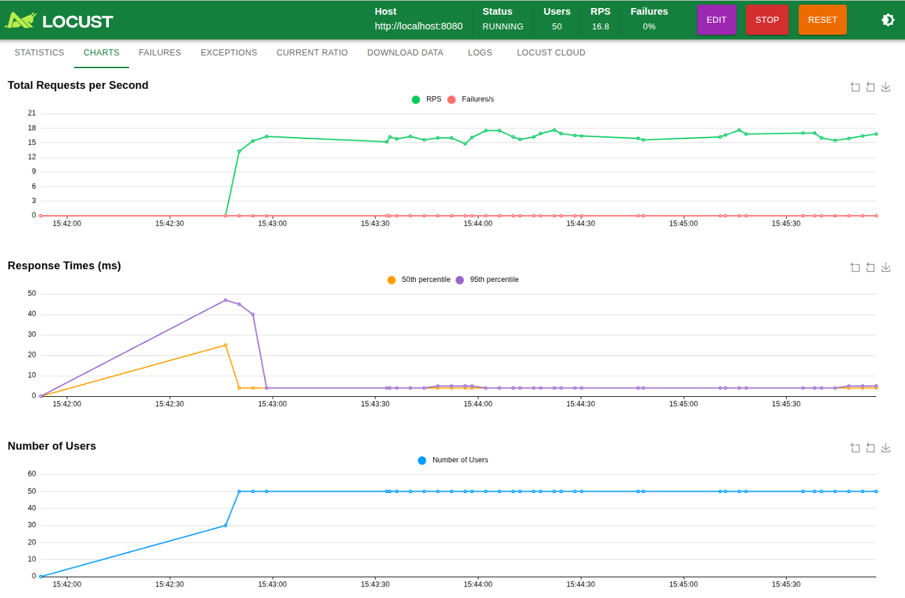
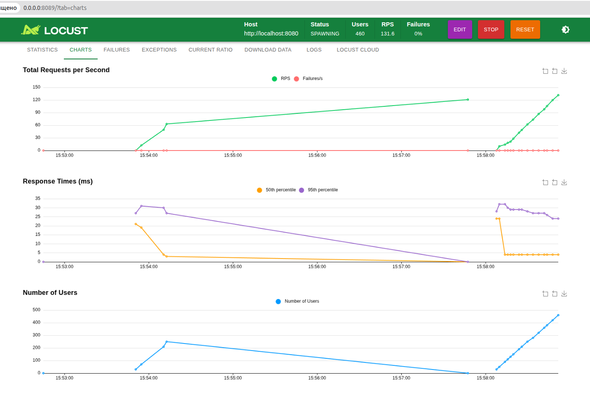
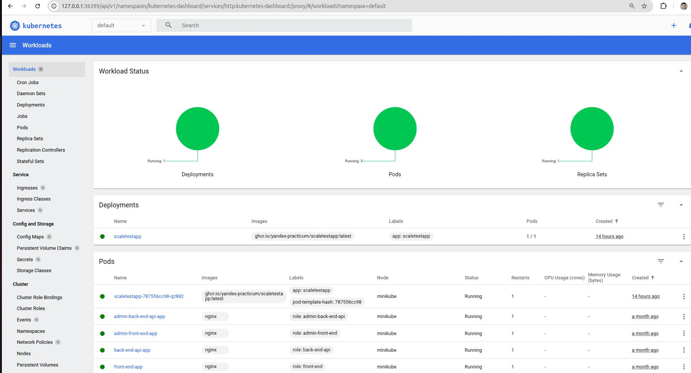

## Подготовка к запуску

### 1. Сборка docker-образа для amd64

1. Клонируем репозиторий приложения:
   ```bash
   git clone https://github.com/yandex-practicum/scaletestapp.git
   ```
2. Сборка под архитектуру:
   ```bash
   docker pull ghcr.io/yandex-practicum/scaletestapp:latest
   ```
3. Загрузка образа в Minikube:
   ```bash
   minikube image load scaletestapp:local
   ```

### 2. Применение манифестов

1. Применить манифесты:
   ```bash
   kubectl apply -f deployment.yaml
   kubectl apply -f service.yaml
   kubectl apply -f hpa.yaml
   ```
2. Убеждаемся, что поды поднялись
   ```bash
   kubectl get pods
   ```

### 3. Тестирование масштабирования

1. Получаем URL сервиса:
   ```bash
   minikube service scaletestapp-service --url
   ```
2. Форвардим порт:
   ```bash
   (.venv) $ kubectl port-forward svc/scaletestapp-service 8080:8080
   Forwarding from 127.0.0.1:8080 -> 8080
   Forwarding from [::1]:8080 -> 8080
   ```

3. Запускаем Locust для генерации нагрузки

    ```bash
    (.venv) $locust -f locustfile.py --host=http://127.0.0.1:38472
    ```

locust откроется http://localhost:8089

4.  Открываем Minikube dashboard:

### Результат

minikube dashboard
🔌  Enabling dashboard ...
    ▪ Используется образ docker.io/kubernetesui/metrics-scraper:v1.0.8
    ▪ Используется образ docker.io/kubernetesui/dashboard:v2.7.0
💡  Some dashboard features require the metrics-server addon. To enable all features please run:

	minikube addons enable metrics-server

🤔  Verifying dashboard health ...
🚀  Launching proxy ...
🤔  Verifying proxy health ...
🎉  Opening http://127.0.0.1:36399/api/v1/namespaces/kubernetes-dashboard/services/http:kubernetes-dashboard:/proxy/ in your default browser...
Окно или вкладка откроются в текущем сеансе браузера.


Нагрузка параметры 50 пользователей, 10 ramp up (users started/seconds): 

 и 1300 пользователей, 10 ramp up (users started/seconds) скриншот в моментае 460 пользоватлей: 


логи hpa:

```bash
    (.venv) kubectl describe hpa scaletestapp-hpa
```
[text](kubectl_describe_hpa_scaletestapp.txt)

скриншоты запущенного пода ScaleTestApp


